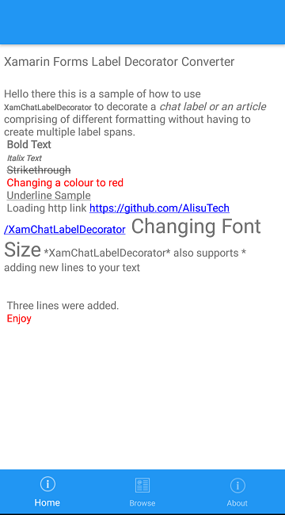

# XamChatLabelDecorator
Xamarin Chat Label Decorator

# Nugget
 [Plugin.XamChatLabelDecoratorConverter](https://www.nuget.org/packages/Plugin.XamChatLabelDecoratorConverter/1.0.3)

# Xaml
 <ContentPage.Resources>
        <xamchatlabeldecorator:ChatLabelDecoratorConverter x:Key="ChatLabelDecoratorConverter"/>
    </ContentPage.Resources>
    <ContentPage.BindingContext>
        <viewmodel:ChatLabelDecoratorViewModel/>
    </ContentPage.BindingContext>
    <ContentPage.Content>
        <StackLayout>
            <Label Text="Xamarin Forms Label Decorator Converter"
                   FontSize="Large" Margin="5,10"/>
            <Label FormattedText="{Binding SampleText, Converter={StaticResource ChatLabelDecoratorConverter}}"
                   Margin="5"
                   FontSize="Medium"/>
        </StackLayout>
    </ContentPage.Content>
    
  # C#-ViewModel
   public class ChatLabelDecoratorViewModel:BaseViewModel
    {
		public ChatLabelDecoratorViewModel()
		{
			SampleText = GetSampleDecoratorText();
		}

		private string GetSampleDecoratorText()
		{
			string sampletext = "Hello there this is a sample of how to use *XamChatLabelDecorator* to decorate a _chat label or an article_ comprising of different formatting without having to create multiple label spans.\n *Bold Text* \n *_Italix Text_* \n ~Strikethrough~ \n %%Red||Changing a colour to red%% \n /-Underline Sample-/ \n Loading http link https://github.com/AlisuTech/XamChatLabelDecorator  ##30||Changing Font Size## *XamChatLabelDecorator* also supports * adding new lines to your text \n\n\n Three lines were added. \n ##50||%%Red||Enjoy%%##";

			return sampletext;
		}

		public string SampleText { get; set; }
	}
  
# Decorator Notations

\*?\* - Bold  
\_?\_ - Italic  
\~?\~ - Strikethrough  
/-?-/ - Underline  
\n - Creates a new line  
##Fontsize||actual text## - Changes font size  
%%Colour||actualtext%% - Changes the colour of a formatted text  

# Limitation
The converter cannot nest a change of colour and fontsize change in the same span.

